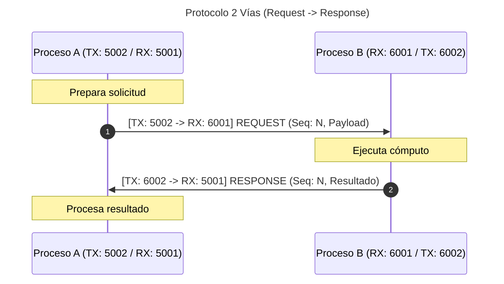
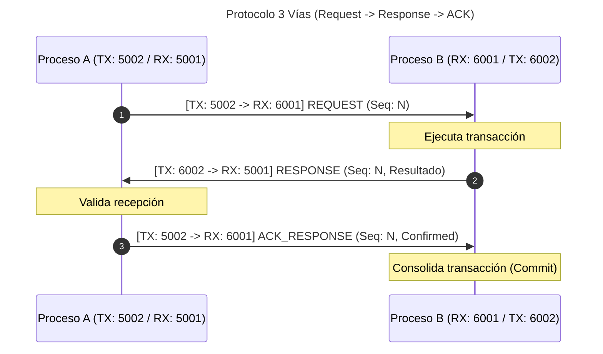
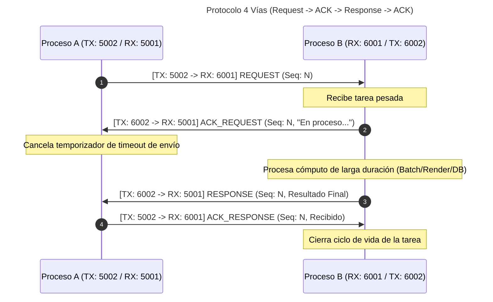

# Sistemas Distribuidos (UTN FRCU) - Trabajos Prácticos de Sockets y Protocolos de Comunicación

Este repositorio contiene la solución completa, modular y documentada pedagógicamente para los ejercicios prácticos de comunicación entre procesos basados en **Sockets** y **Protocolos de Comunicación** en Python.

---

## 📁 Estructura del Proyecto

```text
TPComunicacion/
├── README.md                      # Manual teórico-práctico y guía de ejecución
├── tests/
│   └── test_integracion.py        # Suite de pruebas automatizadas end-to-end
├── ejercicio1/                    # Ejercicio 1: Datagramas UDP
│   ├── emisor_udp.py              # Emisor/Cliente UDP con timeout y control de errores
│   └── receptor_udp.py            # Receptor/Servidor UDP con inspección de buffers
├── ejercicio2/                    # Ejercicio 2: Protocolo Petición-Respuesta Multívía
│   ├── common.py                  # Definición de mensajes y canales desacoplados (RX/TX)
│   ├── proceso_a.py               # Proceso A (Iniciador / Peticionario)
│   └── proceso_b.py               # Proceso B (Respondedor / Servidor)
└── ejercicio3/                    # Ejercicio 3: Comunicación Confiable con TCP
    ├── protocolo_tcp.py           # Protocolo de enmarcado por longitud (Length-Prefixed Framing)
    ├── servidor_tcp.py            # Servidor TCP persistente, multihilo y concurrente
    └── cliente_tcp.py             # Cliente TCP resiliente con auto-reconexión (Exponential Backoff)
```

---

## 🚀 Requisitos y Entorno de Ejecución

- **Python**: Versión 3.8 o superior (se utilizó Python 3.14 estándar).
- **Dependencias externas**: **Ninguna**. Se utiliza estrictamente la biblioteca estándar de Python (`socket`, `argparse`, `threading`, `time`, `struct`, `json`, `sys`, `subprocess`).
- **Sistemas Operativos soportados**: Windows, Linux, macOS.

Para ejecutar todas las pruebas automatizadas y verificar el entorno:
```bash
python tests/test_integracion.py
```

---

## 📘 Ejercicio 1: Datagramas UDP

### 1.1. Fundamento Teórico y Flujo de Paquetes
**UDP (User Datagram Protocol)** es un protocolo de la capa de transporte:
- **No orientado a conexión (Connectionless)**: No existe negociación previa (*Handshake*); el emisor transmite el paquete directamente a la red.
- **No confiable**: No garantiza que el paquete llegue a destino, ni que llegue en orden, ni que no existan duplicados.
- **Orientado a datagramas**: Cada invocación a la primitiva `sendto()` produce un paquete discreto e indivisible en la red.

```
       EMISOR (Cliente)                                RECEPTOR (Servidor)
    ┌────────────────────┐                           ┌─────────────────────┐
    │ socket(SOCK_DGRAM) │                           │ socket(SOCK_DGRAM)  │
    └─────────┬──────────┘                           └──────────┬──────────┘
              │                                                 │
              │                                      ┌──────────▼──────────┐
              │                                      │ bind((ip, puerto))  │
              │                                      └──────────┬──────────┘
              │                                                 │
              │                                      ┌──────────▼──────────┐
              │           Datagrama UDP              │ recvfrom(bufsize)   │
              │ ───────────────────────────────────> │ (Bloqueante)        │
              │   sendto(datos, (ip_dest, port))     └──────────┬──────────┘
              │                                                 │
              │                                      ┌──────────▼──────────┐
              │                                      │ Procesa datagrama   │
              │                                      └──────────┬──────────┘
              ▼                                                 ▼
            close()                                           close()
```

### 1.2. Primitivas de Sockets Utilizadas
- `socket(AF_INET, SOCK_DGRAM)`: Reserva un descriptor en el Sistema Operativo para datagramas IPv4.
- `bind((ip, puerto))`: Asocia el socket a una interfaz de red y puerto local determinado. Indispensable para el receptor.
- `sendto(bytes, (ip, puerto))`: Envía el búfer de bytes directamente al par (IP, Puerto).
- `recvfrom(buffer_size)`: Bloquea el hilo esperando un datagrama. Devuelve una tupla `(datos, (ip_remota, puerto_remoto))`.
- `settimeout(segundos)`: Evita que el socket quede bloqueado indefinidamente lanzando una excepción `socket.timeout`.
- `close()`: Libera el socket y el puerto asignado en la tabla de sockets del kernel.

### 1.3. Manejo de Buffers y Limitaciones
- **Tamaño de Buffer**: Si un datagrama recibido excede el parámetro `buffer_size` configurado en `recvfrom()`, el exceso se descarta a nivel de kernel (en Windows se genera el error `WSAEMSGSIZE` / 10040).
- **MTU (Maximum Transmission Unit)**: En redes Ethernet estándar, el MTU es típicamente de 1500 bytes. Datagramas UDP mayores a ~1472 bytes (1500 - 20 bytes IP - 8 bytes UDP) sufrirán fragmentación a nivel IP, aumentando exponencialmente la probabilidad de descarte de paquetes si se pierde un solo fragmento.

### 1.4. Instrucciones de Ejecución

#### Opción A: Prueba Local (Misma máquina)
1. **Terminal 1 (Receptor):**
   ```bash
   python ejercicio1/receptor_udp.py --ip 127.0.0.1 --puerto 5000 --buffer 1024
   ```
2. **Terminal 2 (Emisor puntual):**
   ```bash
   python ejercicio1/emisor_udp.py --destino 127.0.0.1 --puerto 5000 --mensaje "Hola desde emisor UDP"
   ```
3. **Terminal 2 (Modo interactivo):**
   ```bash
   python ejercicio1/emisor_udp.py --destino 127.0.0.1 --puerto 5000
   # Escribir mensajes en la consola y presionar Enter
   ```

#### Opción B: Comunicación entre dos PCs distintas en la misma LAN
- **Máquina Servidora** (IP: `192.168.1.50`):
  ```bash
  python ejercicio1/receptor_udp.py --ip 0.0.0.0 --puerto 5000
  ```
  *(Nota: `0.0.0.0` instruye al kernel a escuchar en todas las interfaces de red físicas y virtuales).*
- **Máquina Cliente** (IP: `192.168.1.60`):
  ```bash
  python ejercicio1/emisor_udp.py --destino 192.168.1.50 --puerto 5000 --mensaje "Mensaje entre PCs distintas"
  ```

---

## 📙 Ejercicio 2: Protocolo Petición-Respuesta Multívía

### 2.1. Regla Obligatoria: Desacople de Puertos RX y TX
En la mayoría de los ejemplos clásicos de sockets, un proceso envía y recibe a través del mismo socket y puerto. Sin embargo, para cumplir con la consigna de **desacople estricto de puertos de recepción y transmisión**, cada proceso administra **dos sockets simultáneos**:

- **Proceso A**:
  - `Canal RX (Escucha)`: Enlazado con `bind()` a `PORT_A_RX` (ej. 5001).
  - `Canal TX (Emisión)`: Enlazado con `bind()` a `PORT_A_TX` (ej. 5002).
- **Proceso B**:
  - `Canal RX (Escucha)`: Enlazado con `bind()` a `PORT_B_RX` (ej. 6001).
  - `Canal TX (Emisión)`: Enlazado con `bind()` a `PORT_B_TX` (ej. 6002).

```
   ┌────────────────────────────────────────────────────────┐
   │                       PROCESO A                        │
   │  [Puerto TX: 5002]                 [Puerto RX: 5001]   │
   └──────────┬───────────────────────────────────▲─────────┘
              │                                   │
              │  Petición / ACK hacia B_RX        │ Respuesta / ACK desde B_TX
              │                                   │
   ┌──────────▼───────────────────────────────────┴─────────┐
   │  [Puerto RX: 6001]                 [Puerto TX: 6002]   │
   │                       PROCESO B                        │
   └────────────────────────────────────────────────────────┘
```

---

### 2.2. Variantes de Protocolo Implementadas



#### a) Protocolo de 2 Vías (Request -> Response)
- **Flujo**:
  1. `A` transmite `REQUEST` desde su puerto `TX` hacia el puerto `RX` de `B`.
  2. `B` recibe la solicitud en `RX`, procesa el cálculo y envía `RESPONSE` desde su puerto `TX` hacia el puerto `RX` de `A`.
- **Casos de uso en Sistemas Distribuidos**:
  - Llamadas a Procedimientos Remotos (RPC) **idempotentes** (ej. consultas de lectura tipo HTTP GET o DNS lookup).
  - Si se pierde la respuesta, el cliente simplemente reintenta sin riesgo de efectos colaterales.

---



#### b) Protocolo de 3 Vías (Request -> Response -> ACK)
- **Flujo**:
  1. `A` transmite `REQUEST`.
  2. `B` procesa y transmite `RESPONSE`.
  3. `A` recibe la respuesta y transmite de regreso un `ACK_RESPONSE` hacia el puerto `RX` de `B`.
- **Casos de uso en Sistemas Distribuidos**:
  - Operaciones **no idempotentes** o transaccionales (ej. cobro con tarjeta, deducción de saldo bancario).
  - Permite semántica *At-most-once*: el servidor `B` mantiene el resultado en memoria intermedia y solo libera los recursos o hace *commit* definitivo cuando recibe la confirmación `ACK` del cliente.

---



#### c) Protocolo de 4 Vías (Request -> ACK -> Response -> ACK)
- **Flujo**:
  1. `A` transmite `REQUEST`.
  2. `B` confirma inmediatamente con `ACK_REQUEST` que la solicitud fue encolada satisfactoriamente.
  3. `B` realiza el cómputo intensivo o asíncrono y posteriormente transmite `RESPONSE`.
  4. `A` confirma la entrega del resultado final enviando `ACK_RESPONSE`.
- **Casos de uso en Sistemas Distribuidos**:
  - Tareas asíncronas de larga duración (*Long-running jobs*, renderizado, procesamiento de reportes analíticos).
  - Evita falsos *timeouts* y retransmisiones innecesarias del cliente mientras el servidor procesa una solicitud legítima.

---

### 2.3. Instrucciones de Ejecución

#### 1. Prueba de 2 Vías
- **Terminal 1 (Proceso B - Servidor):**
  ```bash
  python ejercicio2/proceso_b.py -p 2 --rx-port 6001 --tx-port 6002 --dest-rx-port 5001
  ```
- **Terminal 2 (Proceso A - Iniciador):**
  ```bash
  python ejercicio2/proceso_a.py -p 2 --rx-port 5001 --tx-port 5002 --dest-rx-port 6001 -m "Consultar saldo"
  ```

#### 2. Prueba de 3 Vías
- **Terminal 1 (Proceso B):**
  ```bash
  python ejercicio2/proceso_b.py -p 3 --rx-port 6001 --tx-port 6002 --dest-rx-port 5001
  ```
- **Terminal 2 (Proceso A):**
  ```bash
  python ejercicio2/proceso_a.py -p 3 --rx-port 5001 --tx-port 5002 --dest-rx-port 6001 -m "Transferir $1000"
  ```

#### 3. Prueba de 4 Vías
- **Terminal 1 (Proceso B):**
  ```bash
  python ejercicio2/proceso_b.py -p 4 --rx-port 6001 --tx-port 6002 --dest-rx-port 5001
  ```
- **Terminal 2 (Proceso A):**
  ```bash
  python ejercicio2/proceso_a.py -p 4 --rx-port 5001 --tx-port 5002 --dest-rx-port 6001 -m "Generar reporte anual"
  ```

*(Nota: Si se omite el flag `-m`, `proceso_a.py` iniciará en modo consola interactiva para disparar transacciones secuenciales numeradas).*

---

## 📕 Ejercicio 3: Comunicación Confiable con TCP

### 3.1. Fundamento Teórico y el Problema del "Byte Stream"
A diferencia de UDP, **TCP (Transmission Control Protocol)** es:
1. **Orientado a conexión**: Requiere un Three-Way Handshake (`SYN`, `SYN-ACK`, `ACK`) previo a la transmisión.
2. **Confiable**: Cada segmento contiene un número de secuencia (`SEQ`) y es confirmado mediante acuse de recibo (`ACK`). Segmentos dañados o perdidos son retransmitidos por el kernel de forma invisible para la aplicación.
3. **Flujo de bytes no estructurado (Byte Stream)**: TCP **no tiene noción de delimitación de mensajes**. Dos llamadas consecutivas `send("Hola")` y `send("Mundo")` pueden fusionarse en un solo segmento por el Algoritmo de Nagle (*coalescencia*), o un mensaje largo puede fragmentarse en múltiples lecturas de `recv()`.

### 3.2. Solución: Length-Prefixed Framing (`protocolo_tcp.py`)
Para garantizar que la aplicación reciba mensajes íntegros y ordenados sin depender de saltos de línea o caracteres centinela, implementamos un protocolo binario con prefijo de longitud:

```
┌──────────────────────────────────────┬────────────────────────────────────────────────────────┐
│   Cabecera Binaria Fija (4 Bytes)    │             Carga Útil UTF-8 (N Bytes)                │
│   Entero sin signo 32-bit (Big-Endian)│             Texto del Mensaje                          │
└──────────────────────────────────────┴────────────────────────────────────────────────────────┘
```
- **Envío**: Se calcula `len(payload)`, se empaqueta con `struct.pack("!I", length)` y se transmite la trama atómica mediante `sendall()`.
- **Recepción**: La función `recibir_mensaje()` lee de forma acumulativa en un bucle exactamente los 4 bytes de cabecera, desempaqueta la longitud $N$, y luego acumula exactamente los $N$ bytes del cuerpo antes de devolver la cadena de texto decodificada.

### 3.3. Persistencia, Concurrencia y Resiliencia
- **Servidor Multihilo**: Cada cliente conectado con `accept()` es derivado a un hilo dedicado (`threading.Thread`), permitiendo que múltiples clientes mantengan abiertas sus sesiones TCP simultáneamente sin interferir entre sí.
- **Cliente Resiliente con Exponential Backoff**: Si la conexión falla o el servidor cae abruptamente (`ConnectionResetError`, `BrokenPipeError`), el cliente no aborta: entra en un ciclo de reintentos duplicando el tiempo de espera progresivamente ($1s, 2s, 4s, 8s, 10s$) hasta que el servidor se restablezca.
- **Cierre Limpio (Graceful Shutdown)**: Se utiliza `sock.shutdown(socket.SHUT_WR)` para enviar el paquete `FIN` indicando que el cliente no transmitirá más datos, se agotan posibles bytes residuales y finalmente se ejecuta `sock.close()`.

```
         CLIENTE TCP                                   SERVIDOR TCP
    ┌────────────────────┐                           ┌─────────────────────┐
    │ socket(SOCK_STREAM)│                           │ socket(SOCK_STREAM) │
    └─────────┬──────────┘                           └──────────┬──────────┘
              │                                                 │
              │                                      ┌──────────▼──────────┐
              │                                      │  bind() + listen()  │
              │                                      └──────────┬──────────┘
              │                                                 │
              │             SYN                      ┌──────────▼──────────┐
              │ ───────────────────────────────────> │ accept() (Bloquea)  │
              │           SYN + ACK                  └──────────┬──────────┘
              │ <───────────────────────────────────            │ Retorna conn
              │             ACK                      ┌──────────▼──────────┐
              │ ───────────────────────────────────> │ Hilo por cliente    │
              │                                      └──────────┬──────────┘
              │         Sesión Persistente                      │
              │   sendall([4B_LEN] + [PAYLOAD])      ┌──────────▼──────────┐
              │ ═══════════════════════════════════> │ recibir_mensaje()   │
              │ <═══════════════════════════════════ │ enviar_mensaje()    │
              │                                      └──────────┬──────────┘
              │           Cierre Limpio                         │
              │   shutdown(SHUT_WR) -> Envia FIN     ┌──────────▼──────────┐
              │ ───────────────────────────────────> │ Detecta EOF (None)  │
              │            close()                   │ close() de conn     │
              ▼                                      ▼
```

### 3.4. Instrucciones de Ejecución

#### 1. Iniciar Servidor TCP
```bash
python ejercicio3/servidor_tcp.py --ip 0.0.0.0 --puerto 7000 --backlog 10
```

#### 2. Iniciar Cliente TCP (Modo interactivo persistente)
```bash
python ejercicio3/cliente_tcp.py --destino 127.0.0.1 --puerto 7000
```
- Escriba múltiples mensajes sucesivos: todos viajarán ordenadamente por el mismo enlace TCP persistente.
- Escriba `salir` para observar el procedimiento de **Graceful Shutdown** (`shutdown(SHUT_WR)` + `close()`).

#### 3. Demostración de Resiliencia ante Desconexión Abrupta
1. Con el cliente interactivo abierto, presione `Ctrl+C` en la terminal del servidor para simular una caída inesperada del servicio.
2. Escriba un nuevo mensaje en la consola del cliente.
3. Observe cómo el cliente detecta el fallo (`ConnectionResetError` o caída de pipe) y comienza a emitir intentos de reconexión con *Exponential Backoff*.
4. Vuelva a iniciar el servidor en su terminal:
   ```bash
   python ejercicio3/servidor_tcp.py --puerto 7000
   ```
5. Observe cómo el cliente se reconecta automáticamente sin intervención manual y retransmite el mensaje pendiente.

---

## 📊 Matriz Comparativa de Protocolos

| Característica | Ejercicio 1 (UDP) | Ejercicio 2 (Petición-Resp. UDP) | Ejercicio 3 (TCP) |
| :--- | :--- | :--- | :--- |
| **Orientación** | Sin conexión (*Connectionless*) | Sin conexión física, sesión lógica | Orientado a conexión (*Connection-oriented*) |
| **Garantía de entrega** | No confiable (Best-Effort) | Confiable a nivel de aplicación (ACKs) | Confiable a nivel de transporte (Kernel TCP) |
| **Puertos utilizados** | Mismo puerto o efímero | **Desacoplados: RX y TX independientes** | Mismo puerto / Par de socket full-duplex |
| **Unidad de datos** | Datagrama indivisible | Datagrama estructurado (JSON) | Stream de bytes enmarcado (*Length-prefixed*) |
| **Persistencia** | No aplica | Por transacción ($2, 3 \text{ o } 4$ vías) | Conexión persistente reutilizable |
| **Control de flujo** | Inexistente | Manejado por temporizadores y ACKs | Ventana deslizante TCP + Buffer de kernel |

---

## 👨‍🏫 Autoría y Cátedra
- **Materia:** Sistemas Distribuidos
- **Universidad:** Universidad Tecnológica Nacional - Facultad Regional Concepción del Uruguay (UTN FRCU)
- **Implementación:** Código modular y comentado pedagógicamente siguiendo las mejores prácticas de ingeniería de software para sistemas distribuidos.
